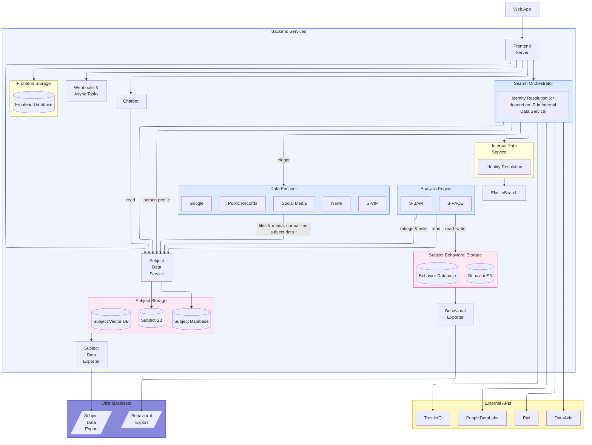
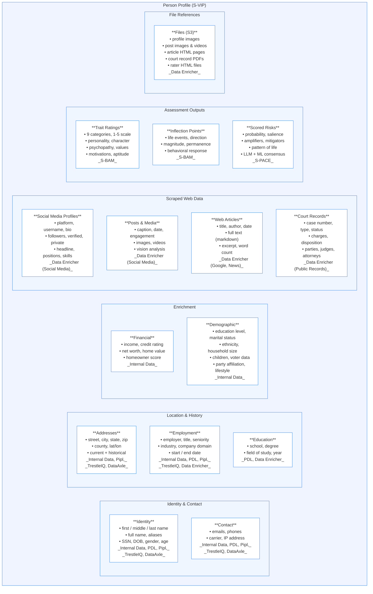

# Sovra Platform Architecture

> Terminology (Person Profile, Record, Trace Data) is defined in [sequence.md](./sequence.md#1-terminology).

## 1. Service Architecture

### Services

| Service | Description | Repo(s) |
|---|---|---|
| **Web App** | React frontend for investigators | [sovra-frontend](https://github.com/sovraai/sovra-frontend) |
| **Frontend Server** | Go API — routes requests to backend services | [sovra-frontend-server](https://github.com/sovraai/sovra-frontend-server), [sovra-frontend-infra](https://github.com/sovraai/sovra-frontend-infra) |
| **Webhooks & Async Tasks** | Lambdas for identity verification (Persona), payment webhooks | [sovra-frontend-lambdas](https://github.com/sovraai/sovra-frontend-lambdas) |
| **Search Orchestrator** | Fans out to all data sources in parallel, resolves entities via union-find, assembles person profiles | [search](https://github.com/sovraai/search) (?); maybe merge [data-api](https://github.com/sovraai/data-api) |
| — **S-VIP** | Sovra Verified Identity Profile — identity resolution and profile assembly | |
| **Internal Data Service** | Elasticsearch index of ~5.7B person records (SSN, Acxiom, voter, breach, social, employment) | [data](https://github.com/sovraai/data) |
| **Data Enricher** | Scrapes and aggregates external web data across four channels: | |
| — **Public Records** | Court records (criminal, civil, family) across US jurisdictions | [courtscrapers](https://github.com/sovraai/courtscrapers) |
| — **General scraping toolkit** | Grant's general-purpose scraping toolkit | [fast_scraping_toolkit](https://github.com/sovraai/fast_scraping_toolkit) |
| — **Social Media & Google/News** | Profiles & posts from Instagram, TikTok, X, Facebook, LinkedIn, etc. | [puppeteer](https://github.com/sovraai/puppeteer) |
| — **Scraper utils** | Ian's scraper utilities, used for Science and Intel | [data-ingestion](https://github.com/sovraai/data-ingestion), [netrows_extraction](https://github.com/sovraai/netrows_extraction), [pdf_parsing](https://github.com/sovraai/pdf_parsing) (deprecated?) |
| — **New subject scraping** | Logic for how to scrape for a new subject | TBD |
| — **Social media ID resolution** | Resolving social media IDs (maybe lives in Internal Data Service) | TBD |
| **Analysis Engine** | Behavioral and risk analysis pipeline, consuming person profiles: | [bam_prototype](https://github.com/sovraai/bam_prototype) |
| — **S-BAM** | Sovra Behavioral Assessment Model — rates psychological traits across 9 categories | |
| — **S-PACE** | Sovra Predictive Assessment & Classification Engine — TBD | |
| **Subject Data Service** | Wrapper service for S3 and Database access — used by Data Enricher (writes) and Chatbot (reads) | Does not exist yet; subject/trace-data/ratings APIs currently in [bam_prototype](https://github.com/sovraai/bam_prototype) |
| **Chatbot** | Conversational interface for querying profiles and assessments (reads via SubjectData Service) | TBD — either a new repo extracted from [bam_prototype](https://github.com/sovraai/bam_prototype), or stays in bam_prototype |
| **Subject Data Exporter** | Reads from Subject Storage and produces SubjectData Export artifacts for ETL and/or notebooks | |
| **Behavioral Exporter** | Reads from Subject Behavioral Storage and produces Behavioral Export artifacts for ETL and/or notebooks | |

---

## 2. Person Profile Data Model

The Person Profile is the central data object. It is assembled by the Search Orchestrator, stored in the Profile Store, and consumed by BAM, Risk Analysis, and the Chatbot.

---

## 3. Person Profile Field Reference

### Identity

| Field | Type | Description | Sources |
|---|---|---|---|
| `id` | string | Profile ID (UUID) | Generated |
| `confidence` | float | Entity resolution confidence (0.55-1.0) | Resolver |
| `match_log` | string[] | How records were linked | Resolver |
| `first_name` | string | First name | All |
| `middle_name` | string | Middle name/initial | ES, Pipl |
| `last_name` | string | Last name | All |
| `full_name` | string | Full display name | All |
| `aka_names` | string[] | Aliases, nicknames, maiden names | ES |
| `name_prefix` | string | Mr., Dr., etc. | ES |
| `name_suffix` | string | Jr., Sr., III | ES |
| `ssn` | string | Social Security Number | ES |
| `ssn_last4` | string | Last 4 digits of SSN | ES |
| `dob` | string | Date of birth (YYYY-MM-DD) | All |
| `alt_dobs` | string[] | Alternative/conflicting DOBs | ES |
| `birth_year` | int | Birth year | ES, PDL |
| `age` | int | Computed age | ES |
| `gender` | string | Gender | ES |

### Contact

| Field | Type | Description | Sources |
|---|---|---|---|
| `emails` | string[] | All known emails (deduplicated, lowercase) | All |
| `phones` | string[] | All known phones (deduplicated, digits only) | All |
| `carrier` | string | Phone carrier | ES |
| `ip_address` | string | Known IP address | ES (breach data) |

### Addresses

| Field | Type | Description | Sources |
|---|---|---|---|
| `street_address` | string | Street address | ES, Pipl, TrestleIQ |
| `unit` | string | Apartment/unit | ES |
| `city` | string | City | All |
| `county` | string | County | ES |
| `state` | string | State abbreviation | All |
| `zip` | string | 5-digit ZIP | ES, Pipl, TrestleIQ |
| `zip4` | string | ZIP+4 | ES |
| `country` | string | Country | ES |
| `lat` | float | Latitude | ES |
| `lon` | float | Longitude | ES |
| `is_current` | bool | Current address flag | TrestleIQ |

### Employment

| Field | Type | Description | Sources |
|---|---|---|---|
| `employer` | string | Company name | All |
| `job_title` | string | Position title | ES, PDL, Pipl, TrestleIQ |
| `seniority` | string | Seniority level | PDL |
| `industry` | string | Industry | ES |
| `company_domain` | string | Company website | PDL |
| `start_date` | string | Start date | Scraper (LinkedIn) |
| `end_date` | string | End date (null if current) | Scraper (LinkedIn) |
| `is_current` | bool | Current job flag | TrestleIQ |

### Education

| Field | Type | Description | Sources |
|---|---|---|---|
| `school` | string | School name | Scraper (LinkedIn), ES |
| `degree` | string | Degree type | Scraper (LinkedIn) |
| `field_of_study` | string | Field/major | Scraper (LinkedIn) |
| `end_year` | int | Graduation year | Scraper (LinkedIn) |

### Financial

| Field | Type | Description | Sources |
|---|---|---|---|
| `income_code` | string | Income bracket code | ES (Acxiom) |
| `household_income` | string | Household income range | ES |
| `credit_rating` | string | Credit rating | ES (Acxiom) |
| `net_worth` | string | Net worth bracket | ES (Acxiom) |
| `home_value` | string | Home value estimate | ES (Acxiom) |
| `homeowner_score` | string | Homeowner probability | ES (Acxiom) |
| `dwelling_type` | string | House, apartment, etc. | ES (Acxiom) |

### Demographic

| Field | Type | Description | Sources |
|---|---|---|---|
| `education_level` | string | Highest education | ES (Acxiom) |
| `marital_status` | string | Marital status | ES (Acxiom) |
| `ethnicity` | string | Ethnicity | ES (Acxiom) |
| `household_size` | int | People in household | ES (Acxiom) |
| `has_children` | bool | Has children | ES (Acxiom) |
| `num_children` | int | Number of children | ES (Acxiom) |
| `party_affiliation` | string | Political party | ES (voter data) |
| `voter_status` | string | Registration status | ES (voter data) |
| `registration_date` | string | Voter registration date | ES (voter data) |
| `lifestyle` | object | Lifestyle indicators | ES (Acxiom) |

### Social Media Profiles

| Field | Type | Description |
|---|---|---|
| `platform` | string | instagram, tiktok, x, facebook, linkedin, etc. |
| `username` | string | Handle |
| `display_name` | string | Display name |
| `bio` | string | Bio/about |
| `profile_pic_url` | string | Profile picture URL |
| `profile_pic_file` | string | S3 path to downloaded pic |
| `followers` | int | Follower count |
| `following` | int | Following count |
| `post_count` | int | Total posts |
| `is_verified` | bool | Verified status |
| `is_private` | bool | Private account |
| `url` | string | Profile URL |
| `location` | string | Location (X, LinkedIn) |
| `headline` | string | Professional headline (LinkedIn) |
| `positions` | object[] | Work history (LinkedIn) |
| `educations` | object[] | Education (LinkedIn) |
| `skills` | string[] | Skills (LinkedIn) |

### Posts & Media

| Field | Type | Description |
|---|---|---|
| `id` | string | Post ID (e.g. "instagram-12345") |
| `platform` | string | Platform |
| `date` | string | Timestamp (ISO 8601) |
| `caption` | string | Post text |
| `url` | string | Direct link |
| `like_count` | int | Likes |
| `comment_count` | int | Comments |
| `share_count` | int | Shares/retweets |
| `media[].type` | string | IMAGE or VIDEO |
| `media[].url` | string | Original URL |
| `media[].file` | string | S3 path |
| `media[].analysis` | object | Vision analysis (description, subjects, setting, mood) |

### Web Articles

| Field | Type | Description |
|---|---|---|
| `title` | string | Headline |
| `url` | string | Article URL |
| `site_name` | string | Publication |
| `author` | string | Author |
| `published_date` | string | Date (ISO 8601) |
| `excerpt` | string | Summary |
| `content` | string | Full text (markdown) |
| `content_file` | string | S3 path to HTML |
| `main_image` | string | Hero image URL |
| `word_count` | int | Word count |
| `confidence` | float | Person-match confidence (0-1) |

### Court Records

| Field | Type | Description |
|---|---|---|
| `case_number` | string | Case number |
| `case_type` | string | CRIMINAL, CIVIL, FAMILY, PROBATE |
| `case_status` | string | ACTIVE, CLOSED, DISPOSED |
| `case_style` | string | Caption ("State v. Smith") |
| `file_date` | string | Filing date |
| `court_location` | string | Court/county/state |
| `jurisdiction` | string | State and county |
| `party_name` | string | Party as listed |
| `party_type` | string | Defendant, Plaintiff, etc. |
| `charges` | string[] | Criminal charges |
| `disposition` | string | Outcome |
| `judges` | string[] | Judges |
| `attorneys` | string[] | Attorneys |
| `detail_file` | string | S3 path to case detail |

### Files (S3)

| Field | Type | Description |
|---|---|---|
| `id` | string | File ID (UUID) |
| `type` | string | profile_image, post_media, article_html, court_record_pdf, rater_html |
| `s3_key` | string | S3 object key |
| `content_type` | string | MIME type |
| `size_bytes` | int | File size |
| `source_url` | string | Original URL |

### Trait Ratings (S-BAM Output)

| Field | Type | Description |
|---|---|---|
| `subject_ratings_id` | string | Subject ratings ID |
| `feature_definition_id` | string | Trait name |
| `rating` | string | Low / Low to Moderate / Moderate / Moderate to High / High |
| `rating_as_number` | int | 1-5 |
| `rating_reasoning` | string | Explanation |
| `confidence` | string | Low, Medium, High |
| `confidence_as_number` | int | 1, 3, or 5 |
| `confidence_reasoning` | string | Explanation for the confidence level |
| `evidence` | object[] | trace_id, quote, relevance_note |

### Classified Risks (S-BAM Output)

| Field | Type | Description |
|---|---|---|
| `risk_feature_definition_id` | string | Risk id |
| `probability` | float | Likelihood (0-1) |
| `calibrated_confidence` | float | Platt-scaled confidence |

### Scored Risks (S-BAM Output)

| Field | Type | Description |
|---|---|---|
| `risk_feature_definition_id` | string | Risk id |
| `composite_score` | float | Overall score |
| `salience` | float | Data prominence |
| `lifestyle_relevance` | float | Lifestyle relevance |
| `meaning.what` | string | Plain language description, type and format TBD |
| `meaning.why` | string | Contextual reasoning, type and format TBD |
| `meaning.how` | string | Behavioral manifestation, type and format TBD |
| `provenance` | dict | TBD, has not been defined |

### Inflection Points (S-BAM Output)

| Field | Type | Description |
|---|---|---|
| `description` | string | What happened |
| `date` | string | When |
| `event_type` | string, None | JobChange, RelationshipChange, Financial, Legal, Health, Education, Relocation, Loss |
| `direction` | string | risk_accelerating or protective |
| `magnitude` | float | Severity |
| `permanence` | string | likely_permanent or likely_temporary |
| `reasoning` | string | Why this is an inflection point |
| `evidence` | object[] | Supporting evidence |
| `behavioral_response` | object | Before/after comparison |
