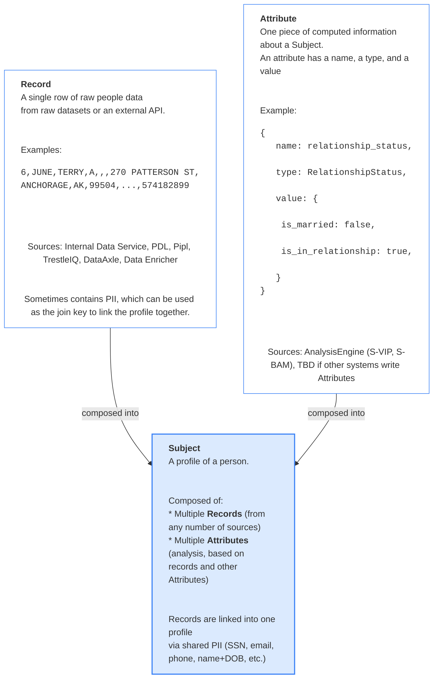

# Sovra Data Flows

## 1. Terminology

---

## 2. Data Flow Sequence

End-to-end flow of a search request, from user query through enrichment and analysis.

```mermaid
%%{init: {'sequence': {'messageAlign': 'left', 'noteAlign': 'left'}}}%%

sequenceDiagram
    actor User
    participant Frontend
    participant SubjectSearch
    %% Pipl, PDL, TrestleIQ, DataAxle
    participant ExternalData
    note right of ExternalData: Pipl, PDL, TrestleIQ, DataAxle

    participant RID as Raw Internal Data
    participant IDS as Internal Data Service

    participant ElasticSearch

    participant SubjectData

    participant DataEnricher

    participant AnalysisEngine

    rect rgb(240, 244, 255)
      Note over RID,IDS: Offline — continuous ingestion
      RID->>IDS: ingest & process raw records
      Note right of IDS: Records with shared PII are joined into<br/>internal-only profiles, ready to be matched<br/>against incoming queries.
      loop for subject in internal subjects
        IDS ->> SubjectData: POST /v1/subjects <br/> { id: int_subject1 }
        note right of IDS: It's odd that IDS writes to both <br/> ElasticSearch and SubjectData.
        IDS ->> ElasticSearch: POST /sovra-subject/_update/1
      end
    end

    rect rgb(232, 245, 233)
      note over User,SubjectData: Subject Search Page
    
      User ->> Frontend: Search "John in Houston"
    
      Frontend ->> SubjectSearch: POST /v1/search
    
      SubjectSearch ->> ElasticSearch: POST /sovra-subject/_search { <br/>#nbsp; query: { <br/>#nbsp;#nbsp; bool: {<br/>#nbsp;#nbsp;#nbsp; filter: { <br/>#nbsp;#nbsp;#nbsp;#nbsp; term: { <br/>#nbsp;#nbsp;#nbsp;#nbsp;#nbsp; namespace: internal <br/>#nbsp;#nbsp;#nbsp;#nbsp;} <br/>#nbsp;#nbsp;#nbsp;} <br/>#nbsp;#nbsp;} <br/>#nbsp;} <br/>}
    
      ElasticSearch ->> SubjectSearch: internal results <br/> [list[Subject]] <br/> [ <br/> #nbsp; { id: int_subject1 }, <br/> #nbsp; { id: int_subject2 }, <br/> #nbsp; ..., <br/>]
    
      SubjectSearch ->> ExternalData: Search
      note left of ExternalData: We might want something between <br/> SubjectSearch and ExternalData for <br/> caching, rate-limiting, and spend-limiting.
    
      ExternalData ->> SubjectSearch: external results <br/> [list[Record]]
    
      SubjectSearch ->> SubjectSearch: convert to list[Subject] <br/> [ <br/> #nbsp; { id: ext_subject1 }, <br/> #nbsp; { id: ext_subject2 }, <br/> #nbsp; ..., <br/>]
    
      loop for subject in external subjects
        note right of SubjectSearch: [ <br/> #nbsp; { id: ext_subject1 }, <br/> #nbsp; { id: ext_subject2 }, <br/> #nbsp; ..., <br/>]
        SubjectSearch ->> SubjectSearch: dedupe with internal subjects

        SubjectSearch ->> SubjectSearch: build list[Attribute] for each subject
      end
    
      loop for subject in deduped subjects
        note right of SubjectSearch: [ <br/> #nbsp; { id: comp_session1_subject1 }, <br/> #nbsp; { id: comp_session1_subject2 }, <br/> #nbsp; ..., <br/>]
        note right of SubjectSearch: Note that we're writing new subjects for every session. <br/> This isn't ideal, but we'll do this until we have a way to <br/> uniquely identify the subjects built from ExternalData.
        SubjectSearch ->> SubjectData: POST /v1/subjects <br/> { id: comp_session1_subjectX }

        SubjectSearch ->> SubjectData: POST /v1/records

        opt write attributes
          note right of SubjectSearch: Open decision: alex@ thinks attributes should be <br/> computed by Analysis Engine, not SubjectSearch. 
          loop for attribute in attributes for subject
            SubjectSearch ->> SubjectData: POST /v1/attributes
          end
        end
      end

      SubjectSearch ->> Frontend: results <br/> list[subject_id]
      loop for subject in results
        Frontend ->> SubjectData: GET /v1/subjects/{subject.id}
      end
      Frontend ->> User: search result page
    end
    
    rect rgb(255, 247, 237)
      note over SubjectSearch,DataEnricher: Online — Async Enrichment
      SubjectSearch-)DataEnricher: trigger enrichment (async)

      note right of DataEnricher: Queue jobs for:<br/> #nbsp; social media, <br/> #nbsp; public records,<br/> #nbsp; Google, <br/> #nbsp; news, <br/> #nbsp; scraped pages

      loop per enrichment job
        DataEnricher->>SubjectData: POST /v1/records
      end
    end

    rect rgb(240, 50, 50)
      note over SubjectData,AnalysisEngine: Online — S-VIP Analysis

      DataEnricher ->> AnalysisEngine: all jobs complete — run S-VIP
      AnalysisEngine ->> SubjectData: GET /v1/subjects/comp_session1_subject1
      SubjectData -->> AnalysisEngine: subject


      AnalysisEngine ->> SubjectData: GET /v1/subjects/comp_session1_subject1/records
      SubjectData -->> AnalysisEngine: list[Record]

      AnalysisEngine ->> AnalysisEngine: compute S-VIP attributes

      loop for attribute in S-VIP attributes
        AnalysisEngine ->> SubjectData: POST /v1/attributes
      end
    end

    rect rgb(254, 226, 226)
      note over SubjectData,AnalysisEngine: Online — S-BAM Analysis

      DataEnricher ->> AnalysisEngine: all jobs complete — run S-BAM
      AnalysisEngine ->> SubjectData: GET /v1/subjects/comp_session1_subject1
      SubjectData -->> AnalysisEngine: subject

      AnalysisEngine ->> SubjectData: GET /v1/subjects/comp_session1_subject1/attributes
      SubjectData -->> AnalysisEngine: list[Attribute]

      AnalysisEngine ->> SubjectData: GET /v1/subjects/comp_session1_subject1/records
      SubjectData -->> AnalysisEngine: list[Record]

      AnalysisEngine ->> AnalysisEngine: run S-BAM pipeline

      loop for attribute in S-BAM attributes
        AnalysisEngine ->> SubjectData: POST /v1/attributes
      end
    end

    rect lightgrey
      AnalysisEngine -) Frontend: notify "analysis complete"
      Frontend -) User: notification — results ready
    end

    rect rgb(240, 230, 255)
      note over User,SubjectData: Subject Detail Page
    
      User ->> Frontend: Open subject comp_session1_1
      Frontend ->> SubjectData: GET /v1/attributes?subject_id=comp_session1_subject1
      SubjectData ->> Frontend: attributes <br/> [list[Attributes]] <br/> [ <br/> #nbsp; { <br/> #nbsp;#nbsp; id: attr1, <br/> #nbsp;#nbsp; name: last_name, <br/> #nbsp;#nbsp; type: name, <br/> #nbsp;#nbsp; value: Smith <br/> #nbsp; }, <br/> #nbsp; { <br/> #nbsp;#nbsp; id: attr2, <br/> #nbsp;#nbsp; name: relationship_status, <br/> #nbsp;#nbsp; type: relationship_status, <br/> #nbsp;#nbsp; value: { <br/> #nbsp;#nbsp;#nbsp; is_married: false, <br/> #nbsp;#nbsp;#nbsp; is_in_relationship: true <br/> #nbsp;#nbsp; } <br/> #nbsp; }, <br/> #nbsp; <br/> #nbsp; ..., <br/>]

    end
    
    

```

### Notes

- **Sync search** assembles the initial Person Profile from internal data and external APIs and writes it to the Subject Data Service. The user sees results immediately.
- **Async enrichment** kicks off the Data Enricher, which queues jobs across all enrichment channels (social media, public records, Google, news). Each completed job writes Trace Data to the Subject Data Service.
- **Analysis** runs the Analysis Engine (S-BAM) over the full profile + trace data. Trait ratings and inflection points are written back to the Subject Data Service; detailed behavioral assessment artifacts are written to Behavioral Storage.
- **Notification** signals the frontend that analysis is complete so the user can view the full results.
