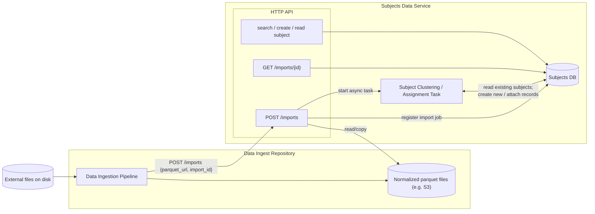
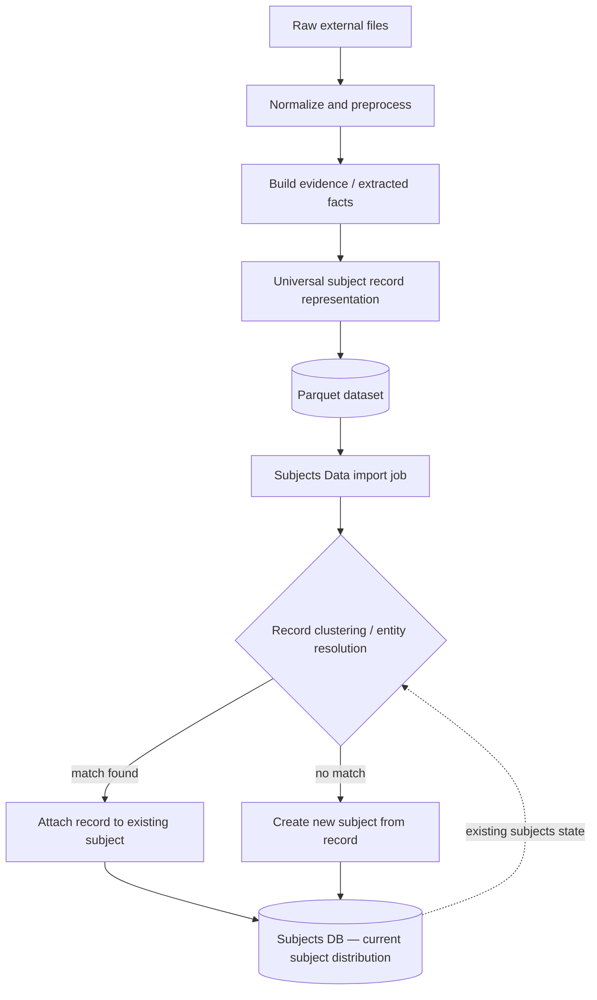
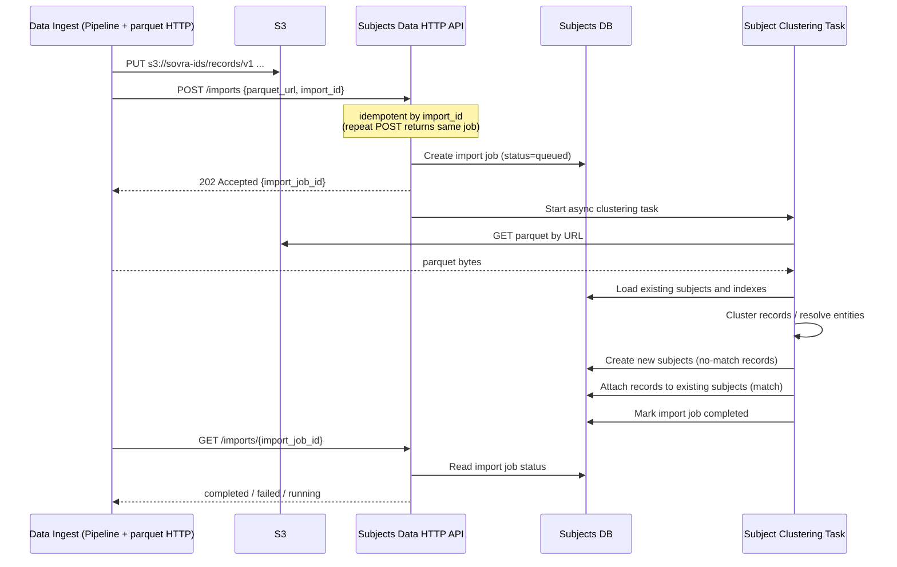

# SOVRA SDS Debate Summary — Data Ingest, subject-data, Clustering, and Next Actions

**Prepared for:** Alex Maeda  
**Context:** Marple + Roman + Maeda + Patrick discussion, follow-up Slack thread, Roman's Mermaid diagrams, and Alex Marple's `004-data-ingestion-steps` proposal  
**Scope:** Summarizes all material changes and current direction from the start of the SDS / DBMS / clustering debate. This intentionally skips the back-and-forth argument details and focuses on outcomes, deltas, and what Alex Maeda should do next.

---

## 1. Executive Summary

The debate started around one core question:

> Where should cross-source subject/profile construction live, and what level of access should it have to subject-data?

Before the debate, the rough shape was:

```text
Data Ingest Pipeline
  -> normalized parquet
  -> maybe Elasticsearch
  -> maybe subject-data
  -> unclear clustering / subject creation
```

After the debate and Slack follow-up, the shape is much clearer:

```text
Data Ingest Pipeline
  -> normalized parquet in S3
  -> subject-data batch import API
  -> subject-data ingests immutable Records
  -> Subject Clustering / Assignment runs later
  -> Clustering links Records to existing Subjects or creates new Subjects
  -> Attributes are separate first-class objects, created/updated later
  -> Search index is derived from subject-data, likely mostly Attributes -> subject_ids
```

The biggest shift is that **Elasticsearch is no longer the ingestion target or source of truth**. The production source of truth is **subject-data**. Search infrastructure, whether Elasticsearch/OpenSearch/Athena/EMR, is a derived or supporting read path, not the authoritative write target.

The second major shift is that **Records should be ingested before Clustering**. Data Ingest does not have to solve identity resolution before writing to subject-data. It produces normalized Records, subject-data stores them, and Clustering runs as a later step.

For Alex Maeda, the immediate task is now much more concrete:

> Build the SDS-side batch ingest plumbing and data model surface, not the clustering algorithm.

---

## 2. Starting Point Before the Debate

### 2.1 What was already mostly agreed

Before the DBMS debate, the team had already converged on several points:

- `subject-data` is intended to be the authoritative service for Subjects, Records, and eventually Attributes.
- Data Ingest produces normalized parquet output.
- The initial ingest interface should be **batch-based**, not per-record REST calls.
- The ingest API should be **idempotent** using a caller-provided import or batch ID.
- The import should be asynchronous:
  - `POST` starts or registers the job.
  - `GET` checks job status.
- Roman was concerned about performance and avoiding unnecessary HTTP overhead for very large datasets.
- Alex Marple was concerned about service boundaries, observability, authorization, and not coupling writers directly to the current DBMS.

### 2.2 What was unresolved

The unresolved pieces at the start were:

- Does Roman's pipeline write Records only, Subjects too, or Attributes too?
- Where does subject/profile construction happen?
- Does the clustering / resolver read directly from the DB?
- Does it read through subject-data APIs?
- Does it consume a snapshot/export?
- Does subject-data own a search index?
- Is Elasticsearch part of production or only development / investigation?
- How do Records connect to Subjects?
- Are Records mutable or immutable?
- How are static file-based sources different from streaming/API sources?

---

## 3. Main Architectural Changes from the Debate

### 3.1 `subject-data` is the source of truth

The team aligned around this direction:

```text
subject-data owns:
  - Subjects
  - Records
  - Attributes
  - Record <-> Subject links
  - import job tracking
  - service boundary / API contract
```

Data stores like Postgres, DynamoDB, S3, Elasticsearch, OpenSearch, Athena, or EMR are implementation details behind or adjacent to subject-data.

The important abstraction is:

> Other systems should depend on the subject-data interface, not on the subject-data database.

This matters because subject-data may start on Postgres but could later move to DynamoDB or another store. If other services access Postgres directly, any database migration becomes a cross-service migration.

### 3.2 Data Ingest does not write directly to Elasticsearch for production

Before the debate, Roman had been thinking about Elasticsearch as the final representation or at least the next destination for normalized data.

That changed.

Current direction:

```text
Data Ingest -> S3 parquet -> subject-data import job -> subject-data DB
```

Elasticsearch/OpenSearch may still exist, but as a derived search index, not the authoritative ingestion target.

The team also distinguished between:

- **Roman's / Hetzner Elasticsearch**: development / investigation / internal use.
- **Production search index**: a future index owned or populated by subject-data or a subject-search path.

### 3.3 Records are ingested before Clustering

This is one of the clearest decisions.

The team now expects:

```text
Step 5: Ingest Records
Step 6: Cluster Records into Subjects and Attributes
```

This means:

1. Data Ingest produces normalized Records.
2. subject-data imports those Records.
3. Records may initially have no `subject_id`.
4. A later clustering / assignment task decides whether each Record attaches to an existing Subject or creates a new Subject.

Why this decision matters:

- If Clustering fails, Records are still safely persisted.
- Records can be processed by other systems before they are assigned to Subjects.
- Clustering can use all existing Records, not only the current import batch.
- The clustering algorithm can evolve without blocking the basic ingest path.

### 3.4 Records are treated as immutable

The current leaning is:

> Records are immutable once written.

This means if a source like PDL changes over time, the system may store a new Record rather than mutating the old one.

Example:

```text
time_1: PDL says John lives in Houston
time_2: PDL says John lives in Austin
```

Likely handling:

```text
Record A: PDL response at time_1
Record B: PDL response at time_2
```

Readers or downstream logic can then decide:

- use latest only,
- use records within a time range,
- use all records for audit/history,
- or derive current-state Attributes from them.

Potential tags may help readers filter:

```text
latest
historical
superseded
source:pdl
batch:...
```

### 3.5 Subjects are mutable

Unlike Records, Subjects may mutate as new evidence arrives.

A Subject starts as an identifier / container, then changes over time as Records are attached or detached and Attributes are updated.

Current mental model:

```text
Subject
  - stable ID
  - linked Records
  - derived Attributes
```

The Subject itself is not where all values live. The values live in Attributes.

### 3.6 Attributes are separate first-class objects

This was already agreed in the previous session and remains important here.

Attributes are not fields directly on the Subject object.

Instead:

```text
Subject
  -> Attribute: name
  -> Attribute: phone
  -> Attribute: email
  -> Attribute: address
  -> Attribute: relationship_status
  -> Attribute: risk / behavioral / S-BAM outputs later
```

Attributes may be:

- structured,
- versioned,
- confidence-bearing,
- derived from multiple Records,
- written by multiple producers,
- updated independently from Subjects and Records.
  
  

### 3.7 Clustering / Subject Assignment is the contested element

The debate narrowed down to one contested component:

> Subject Clustering / Assignment Task

This component does entity resolution:

```text
incoming Record
  -> compare against existing Records / Subjects
  -> match found?
      yes -> attach Record to existing Subject
      no  -> create new Subject
```

The team does not yet have a final implementation decision for where this runs.

Possibilities still on the table:

#### Option A — Inside subject-data

The clustering task lives as part of the subject-data service or repo.

Pros:

- close to data,
- can use subject-data internals,
- easier to coordinate writes,
- avoids having a separate service directly access the DB.

Cons:

- subject-data becomes more than CRUD/storage,
- clustering may be batch-heavy and compute-heavy,
- may complicate subject-data deployment.

#### Option B — Separate process/service using subject-data APIs

The clustering task is its own service but reads/writes through subject-data.

Pros:

- clean service boundaries,
- subject-data remains authoritative,
- easier observability/auth/throttling at API layer.

Cons:

- may be expensive for large reads/writes,
- may need bulk read/export/search endpoints.

#### Option C — Separate process using subject-data export/snapshot

subject-data periodically exports its state to S3/Athena/EMR/OpenSearch/etc. Clustering reads that export.

Pros:

- good for offline/batch processing,
- avoids high-volume HTTP reads,
- clustering can scan large datasets.

Cons:

- introduces freshness lag,
- requires sync/export machinery,
- more moving parts.

Current leaning:

> Start by making the interfaces clear. Clustering is likely separate from simple Record ingest, but it may live in or near subject-data. The exact read path is still open.

---

## 4. Roman's Mermaid Diagrams — What They Added

Roman shared diagrams in Slack to explain the interaction between services.

### 4.1 Components diagram



Key changes implied by this diagram:

- Data Ingest stops at normalized parquet.
- subject-data owns `/imports`.
- subject-data owns import job state.
- Subject Clustering / Assignment is shown inside subject-data.
- ClusterTask reads existing subjects and creates/attaches Records.
- The contested thing is ClusterTask placement and DB access, not the batch import interface.

### 4.2 Data Flow diagram



key implications:

- Data Ingest produces a universal normalized Record representation.
- The import job is the bridge from parquet into subject-data.
- Clustering needs existing subject state.
- Clustering can attach to existing Subjects or create new Subjects.
- Subjects DB represents the current subject distribution.
- Records are immutable; Subjects mutate as new evidence arrives.

### 4.3 Batch Load Sequence diagram



Alex Marple later updated this by removing the parquet HTTP server idea and preferring S3 as the shared storage location.

Important sequence changes:

- Data Ingest writes parquet to S3.
- Data Ingest calls `POST /imports`.
- The API creates a queued job.
- The import job is idempotent by `import_id`.
- subject-data starts an async task.
- The async task pulls parquet from S3.
- The task handles import and/or clustering.
- Data Ingest polls `GET /imports/{id}` for status.

---

## 5. Alex Marple's Markdown Proposal — Major Changes

Alex Marple updated the architecture proposal in `004-data-ingestion-steps.md`.

### 5.1 Components

The updated components section says:

- Data Ingestion normalizes raw external files into parquet.
- Data Ingestion publishes parquet to S3.
- subject-data owns:
  - HTTP API,
  - `POST /imports`,
  - subjects database.
- The contested element is Subject Clustering Task.
- Subject Clustering Task:
  - lives outside Data Ingestion Pipeline,
  - possibly lives inside subject-data,
  - reads existing Records and Subjects,
  - writes new Subjects / links.

This explicitly removes Data Ingest as the owner of subject creation.

### 5.2 Data Flow

The data flow is now:

```text
Raw external files
  -> Normalize and preprocess
  -> Build evidence / extracted facts
  -> Universal subject record representation
  -> Parquet dataset
  -> subject-data import job
  -> Record clustering / entity resolution
  -> attach to existing subject OR create new subject
  -> Subjects DB
```

Important updates:

- Records are immutable once written.
- Subjects may mutate as new Records arrive.
- Attributes may mutate as new Records arrive.
- Clustering operates after import.
- Current subject distribution feeds back into clustering.

### 5.3 Step 5: Ingest Records

Alex's proposal now includes Step 5 as a standalone step.

Input:

```text
Records with platform_data.normalized populated
```

Output:

```text
Records available to search by PII
```

Open questions in Step 5:

- Should Records go to S3, Elasticsearch, or authoritative store?
- If Records go to subject-data first, how does Clustering read them?
- Should Records be searchable immediately?
- Is an index required before Clustering?
- Should Records be written via batch operation or per-record operation?

Decision added:

> Ingest Records before Clustering / Step 6.

Alex's thought:

> Having visibility into all Records, not just the subjects currently being ingested, is reason enough to ingest first and then run Clustering.

Roman's thought:

> Persist Records first, label them as new, then run algorithms that enrich the DB with Subjects, then label processed Records as old.

### 5.4 Step 6: Cluster Records into Subjects & Attributes

Step 6 is now separate.

Input:

```text
Records from Step 5
```

Possible read methods:

- read all records,
- search by normalized fields,
- read by PII,
- use Elasticsearch/OpenSearch,
- use Athena over S3,
- use EMR,
- use subject-data REST API,
- read a snapshot from authoritative store,
- maybe direct DB read if later approved.

Output:

```text
Subjects
Subject ID for each Record
Attributes
```

Open questions:

- Does Clustering need existing Subjects to avoid duplicates?
- Why does Clustering need to read from authoritative store instead of Step 4 output?
- Is Clustering invoked on each Record write?
- Or is Clustering a standalone async task?
- Does Clustering need low-latency query?
- What search/indexing layer supports it?

### 5.5 Sequence section

The sequence section now frames the import as:

```text
Data Ingest finishes parquet
  -> notifies subject-data
  -> subject-data starts async import/clustering
  -> Data Ingest polls status
```

The proposal explicitly asks:

> Is Clustering invoked on each Record write, or is it a standalone task?

#### Option A — Standalone task

Pros:

- Create/Update Record remains simple.
- Record write cost is predictable.
- Good fit for bulk jobs with unknown Record counts.
- Can use bulk reads/writes to subject-data store.

Cons:

- No trigger to update Attributes in real time.
- Needs bulk read/write mechanics.

#### Option B — Triggered on Record writes

Pros:

- Clustering operates on smaller numbers of Records/Subjects.
- Better suited to parallel processing.
- Attributes update in real time.

Cons:

- Write cost becomes unpredictable.
- Logic lives inside subject-data.
- Harder for complex logic or agentic decisions.
- Requires lookup/search of Records by content.

---

## 6. Slack Follow-up After the Debate

### 6.1 Roman's clarification

Roman clarified:

- He answered Alex's question in proposal text.
- He created diagrams to explain his idea.
- All diagrams show the same idea of interaction between services.
- He prefers to materialize the input for clustering before chatting further about implementation.
- He agreed that Records are immutable.
- He emphasized two kinds of record sources:
  - static file-based sources,
  - streaming/API sources.
- Static file Records can be immutable.
- API-based sources like PDL may produce update-like behavior.
- Those cases are harder and may need separate handling.
- Clustering is planned to start in about two weeks, after finishing the Data Ingestion Pipeline.

Roman's near-term action plan:

1. Need an S3 storage location accessible by both services.
2. Finish the pipeline and upload sample data to S3.
3. In about a week, discuss clustering approach and close remaining open questions.
4. In about two weeks, start implementing clustering logic.

### 6.2 Alex Marple's Slack updates

Alex Marple updated the PR / markdown proposal and noted:

- He removed the parquet HTTP server.
- Data should just live in S3.
- S3 can be accessed via HTTP, Athena, EMR, etc.
- Records are immutable.
- He added a note about PDL-like cases where data for the same person can change over time.
- There is still an open question about whether reading/writing Records triggers Clustering, or whether Clustering is a separate process.
- He agreed with Roman that they are now mostly speaking the same language.
- He asked Roman whether Roman would work on clustering after the Data Ingestion Pipeline.
- Roman said yes, Jimmy set a goal to start in about two weeks.

### 6.3 Alex Marple's direct update to Alex Maeda

Alex Marple then clarified Alex Maeda's near-term work:

#### 1. Batch create API for Records is still needed

Alex Marple still wants a batch create API for Records.

Suggested implementation direction:

- Create an S3 bucket owned by subject-data.
- Create IAM role(s) and policy(ies) allowing Data Ingestion Pipeline to write to it.
- Tentatively do **not** allow `DeleteObject`.
- Maybe require:

```text
s3:if-none-match: "*"
```

to prevent modification / overwrite.

Also needed:

- A `GET` resource to check update/import status.

#### 2. Batch create/update for Subjects and Attributes is likely needed too

The first priority is Records, but the same batch pattern should probably extend to:

- Subjects,
- Attributes.

This means the API shape should not be hardcoded to Records forever.

#### 3. PUT resource to link Records to Subjects is needed

Alex Marple wants a resource for linking Records to Subjects.

Purpose:

- Clustering decides a Record belongs to a Subject.
- Then Clustering calls this resource or equivalent.
- subject-data records the association.

Design concerns:

- idempotency,
- whether links can be removed,
- whether historical links are preserved,
- whether one Record can link to multiple Subjects,
- whether relationship metadata is needed.

#### 4. Clustering will read from subject-data

Alex Marple clarified that Clustering will read data from subject-data.

Still unknown:

- Will it read in bulk?
- Will it use Athena?
- Will it use EMR?
- Will it use Elasticsearch/OpenSearch?
- Will it read/query directly from the DB?
- Will it read via API?
- Will it read from a snapshot/export?

This is **not fully decided yet**.

But the important point is:

> Clustering reads subject-data state, not just current Data Ingest output.

#### 5. Elasticsearch/OpenSearch is needed for subject-search, not necessarily Records

Alex Marple's current opinion:

- Elasticsearch/OpenSearch is needed for `subject-search`.
- The search index should probably contain data from **Attributes**.
- Search should use indexed Attribute data to obtain `subject_ids`.
- Records are not required in the search index unless there is a known consumer.
- Do not index Records yet unless Clustering or another system needs them.

This is an important narrowing:

```text
subject-search probably searches Attributes -> returns subject_ids
```

not:

```text
subject-search searches all Records
```

#### 6. Clustering is offline and does not need low-latency query

Clustering can happen offline.

Therefore, it may not need real-time Elasticsearch/OpenSearch.

Possible tooling:

- Athena,
- EMR,
- S3 snapshots,
- batch exports,
- offline processing.

Main open question:

> How do we keep offline tables / snapshots in sync with the subject-data DB?

---

## 7. Current System Model

### 7.1 Near-term write flow

```text
Data Ingest
  -> normalize external files
  -> build evidence / extracted facts
  -> produce universal record parquet
  -> write parquet to subject-data-owned S3 bucket
  -> call subject-data import endpoint

subject-data
  -> create import job
  -> process parquet asynchronously
  -> ingest immutable Records
  -> mark import job status
```

### 7.2 Later clustering flow

```text
Subject Clustering / Assignment Task
  -> reads Records and existing Subjects from subject-data
  -> determines match/no match
  -> creates new Subjects when no match
  -> links Records to existing Subjects when match
  -> eventually creates/updates Attributes
```

### 7.3 Search flow

```text
subject-data
  -> owns Subjects / Records / Attributes

subject-data or subject-search process
  -> builds derived search index from Attributes

subject-search
  -> searches index
  -> returns subject_ids
  -> caller reads authoritative details from subject-data
```

---

## 8. Decisions Made / Strong Current Direction

### 8.1 Decisions

- Use S3 as the shared location for parquet.
- subject-data should own the S3 bucket for ingest artifacts.
- Data Ingest writes normalized parquet to the subject-data-owned S3 bucket.
- Data Ingest calls a subject-data import endpoint after publishing parquet.
- Import endpoint should be idempotent.
- There should be a status/read endpoint for import jobs.
- Records should be ingested before Clustering.
- Records are immutable once written.
- Subjects are mutable.
- Attributes are mutable and first-class.
- Clustering reads from subject-data.
- Elasticsearch is not the source of truth.
- Search index is derived, not authoritative.
- Do not index Records unless there is a concrete consumer.

### 8.2 Strong leanings, not final

- Clustering is probably a standalone async/batch process, not triggered immediately on every Record write.
- Clustering may live inside subject-data or near it, but final placement is still open.
- Clustering likely starts in about two weeks.
- First SDS implementation should focus on batch Record ingestion, not Clustering.
- Subject search will likely index Attributes rather than Records.
- Athena/EMR may be enough for offline Clustering reads.
- OpenSearch/Elasticsearch may be required for user-facing subject-search.

---

## 9. What Alex Maeda Should Do Now

### 9.1 Immediate priority: Batch Record ingest

This is the most concrete task.

Design and/or implement:

```http
POST /v1/imports
```

or equivalent.

Request shape could be:

```json
{
  "import_id": "data-ingest-pdl-v1-2026-04-29",
  "resource_type": "records",
  "s3_uri": "s3://subject-data-imports/records/pdl/v1/",
  "format": "parquet",
  "schema_version": "records.v1"
}
```

Response:

```json
{
  "import_job_id": "job_123",
  "status": "queued"
}
```

Status endpoint:

```http
GET /v1/imports/{import_job_id}
```

Response:

```json
{
  "import_job_id": "job_123",
  "import_id": "data-ingest-pdl-v1-2026-04-29",
  "resource_type": "records",
  "status": "running",
  "created_at": "...",
  "started_at": "...",
  "finished_at": null,
  "records_seen": 100000,
  "records_written": 99900,
  "records_failed": 100,
  "errors": [
    {
      "row": 1234,
      "code": "invalid_record",
      "message": "..."
    }
  ]
}
```

Recommended statuses:

```text
queued
running
succeeded
partial
failed
```

### 9.2 Define the S3 ingest bucket contract

Draft a short design for:

```text
subject-data-owned S3 bucket
```

Include:

- bucket ownership,
- write role for Data Ingest,
- allowed actions:
  - `PutObject`
  - maybe `AbortMultipartUpload`
  - maybe `ListBucket` for limited prefix,
- denied actions:
  - `DeleteObject`
  - maybe overwrite,
- prefix layout.

Possible prefix layout:

```text
s3://subject-data-imports/
  records/
    v1/
      peopledatalabs/
        import_id=...
          part-00001.parquet
          part-00002.parquet
  subjects/
    v1/
  attributes/
    v1/
```

Call out the open question around enforcing no overwrite:

```text
s3:if-none-match: "*"
```

### 9.3 Keep the API reusable for Subjects and Attributes

Even if v1 only implements Records, do not design the job model so narrowly that it cannot support:

```text
records
subjects
attributes
record_subject_links
```

Recommended internal model:

```text
ImportJob
  id
  import_id
  resource_type
  s3_uri
  format
  schema_version
  status
  counts
  writer
  created_at
  updated_at
```

Where `resource_type` can initially be:

```text
records
```

and later expand to:

```text
subjects
attributes
record_subject_links
```

### 9.4 Design the Record-to-Subject link endpoint

Draft one or two options.

Preferred clean option:

```http
PUT /v1/subjects/{subject_id}/records/{record_id}
```

Request:

```json
{
  "writer": "subject-clustering",
  "confidence": 0.98,
  "reason": "matched on ssn",
  "evidence_refs": ["record:pdl_1"]
}
```

Alternative:

```http
PUT /v1/records/{record_id}/subject
{
  "subject_id": "subj_123"
}
```

Need to decide:

- Is the link stored on Record?
- Or as a join table / relationship object?
- Does link history matter?
- Can a Record be reassigned?

Given the conversation, a relationship object may be safer long-term:

```text
SubjectRecordLink
  subject_id
  record_id
  writer
  confidence
  reason
  created_at
  superseded_at?
```

### 9.5 Do not solve Clustering now

Do **not** block the batch ingest API on:

- final clustering algorithm,
- Athena vs EMR,
- DB vs API,
- OpenSearch,
- subject merge/split,
- attributes derivation.

Treat Clustering as a later consumer of:

- Records,
- Subjects,
- Record <-> Subject links,
- Attributes.

### 9.6 Write a small design doc / PR comment

The best next artifact is a short design note with:

```text
1. What v1 implements
2. What v1 intentionally does not implement
3. Endpoint shapes
4. S3 bucket/permission sketch
5. Import job lifecycle
6. Record ID assumptions
7. Record-to-Subject link resource sketch
8. Open questions
```

Suggested title:

```text
subject-data batch ingest v1 proposal
```

---

## 10. Suggested Slack Reply to Alex Marple

```text
Got it, this helps a lot.

I'll focus the first pass on batch Record create owned by subject-data:
- subject-data-owned S3 bucket/prefix
- import job resource
- POST to register/start import
- GET to check status
- async processing of parquet
- idempotency by import_id

I'll keep the job model flexible enough that we can reuse the same pattern for Subjects and Attributes later.

I'll also sketch a PUT resource for linking Records to Subjects.

I'll treat Clustering read/query strategy as still open and won't block the initial Record ingest work on that.
```

---

## 11. Suggested Implementation Order

### Phase 1 — Design only

1. Draft API shapes:
   - batch Record import,
   - import status,
   - Record-to-Subject link.
2. Draft S3 bucket contract.
3. Draft import job schema.
4. Share with Alex Marple, Roman, Patrick.

### Phase 2 — Skeleton implementation

1. Migration:
2. API routes:
3. Handler stubs.
4. Idempotency by `import_id`.
5. Minimal in-process worker scaffold.

### Phase 3 — S3 / parquet integration

1. Read S3 URI.
2. Parse parquet.
3. Validate schema.
4. Upsert immutable Records.
5. Record counts/errors.
6. Mark job status.

### Phase 4 — Later

1. Batch Subjects.
2. Batch Attributes.
3. Clustering integration.
4. Search index population.
5. Attribute derivation.

---

## 12. Key Takeaway for Alex Maeda

Your job is now much clearer:

```text
Build the SDS-side import + linking primitives.
Do not solve entity resolution yet.
Design so clustering can plug in later.
```

Near-term deliverables:

1. **Batch Record import design**
2. **Import job status model**
3. **S3 bucket / permissions sketch**
4. **Record-to-Subject link endpoint**
5. **Forward-compatible job model for Subjects and Attributes**
6. **List of open questions for Clustering**

If you do those, you're exactly aligned with Marple's latest direction.

---

## 13. One-Sentence Summary

Data Ingest produces immutable normalized Records into S3; subject-data owns batch import, source-of-truth storage, and later Record-to-Subject links; Clustering is a separate unresolved task that reads subject-data state and eventually creates/updates Subjects and Attributes.
