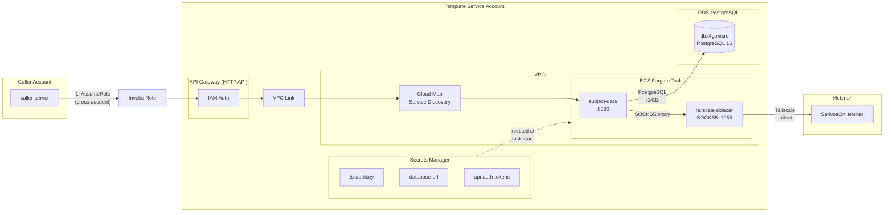
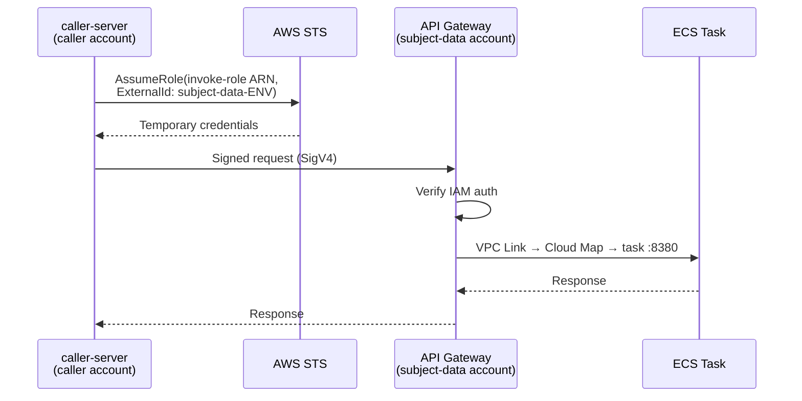

# Subject Search — Infrastructure Architecture

## Overview

Subject Data Service a simple server-to-server API deployed to its own AWS account (one per environment). Calls are authenticated via cross-account IAM roles.

## Request Flow

## Cross-Account Auth

## Key Details

| Component             | Detail                                                   |
|-----------------------|----------------------------------------------------------|
| **Database**          | RDS PostgreSQL 16, db.t4g.micro, 20GB gp3, single-AZ    |
| **Launch type**       | Fargate (512 CPU / 1024 MB)                              |
| **Tailscale mode**    | Userspace (`TS_USERSPACE=true`, SOCKS5 on `:1055`)       |
| **HS connectivity**   | App → SOCKS5 proxy → Tailscale tailnet → `dev:9200`      |
| **API auth**          | IAM (SigV4) at API Gateway, cross-account invoke role    |
| **Service discovery** | Cloud Map private DNS (`subject-data-ENV.local`)         |
| **Secrets**           | Secrets Manager, injected by ECS at task start           |
| **State**             | Pulumi S3 backend (`s3://pulumi-state-subject-data-ENV`) |
| **Region**            | `us-east-2`                                              |
